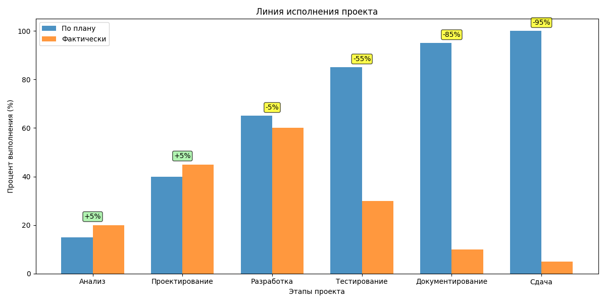
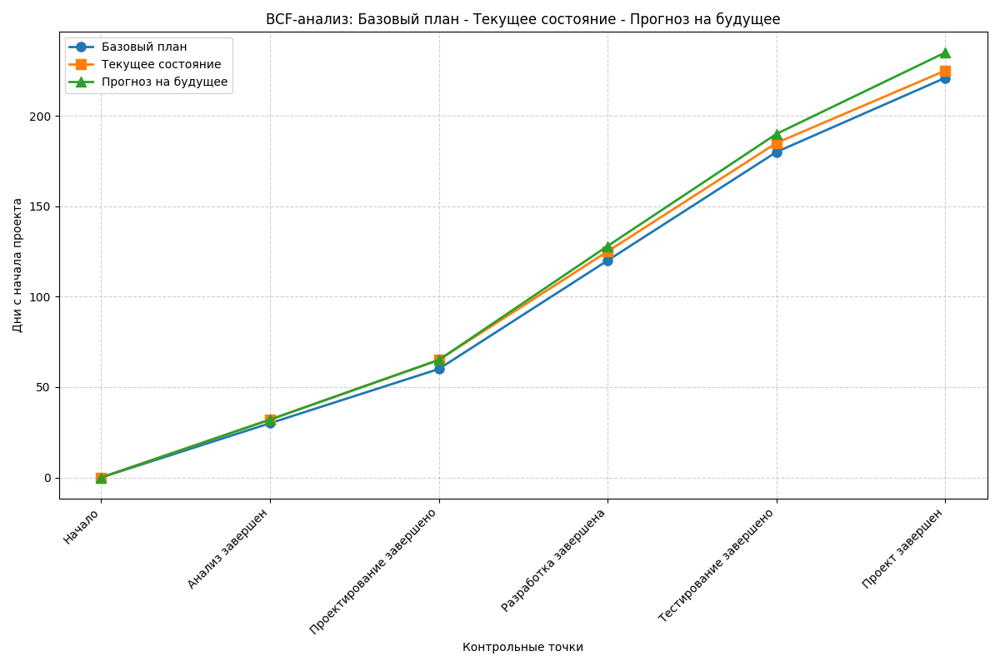
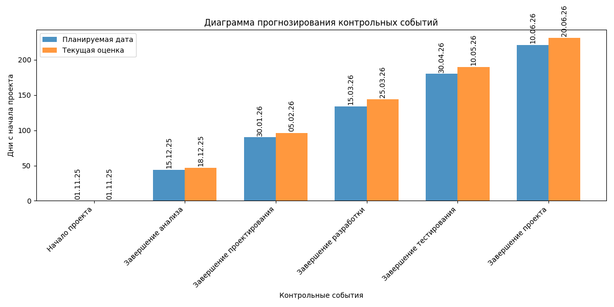
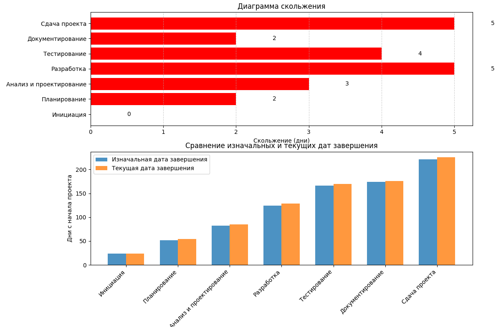
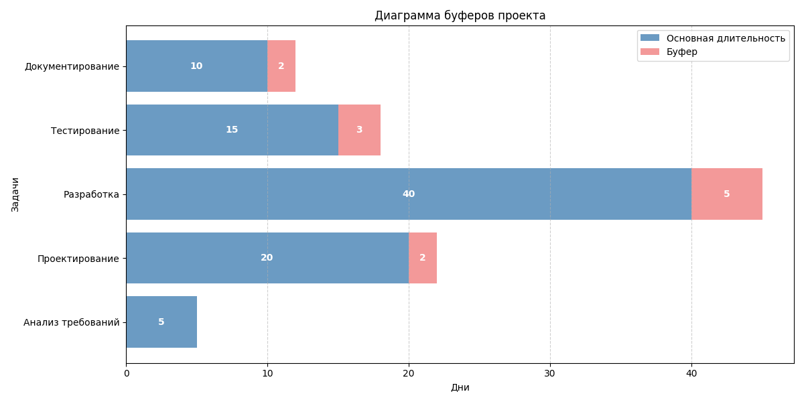

# Управление расписанием проекта "Разработка веб-интерфейса для автоматического развертывания и мониторинга кластера КХД"

## Содержание
1. [Иерархическая структура работ (ИСР)](#1-иерархическая-структура-работ-иср)
2. [Список операций проекта](#2-список-операций-проекта)
3. [Оценка длительности операций](#3-оценка-длительности-операций)
4. [Определение последовательности операций](#4-определение-последовательности-операций)
5. [Разработка расписания](#5-разработка-расписания)
6. [Метод критического пути](#6-метод-критического-пути)
7. [Распределение ресурсов](#7-распределение-ресурсов)
8. [Крутизна операций](#8-крутизна-операций)
9. [Диаграммы контроля расписания](#9-диаграммы-контроля-расписания)
   - [Линия исполнения](#91-линия-исполнения)
   - [BCF-анализ](#92-bcf-анализ)
   - [Диаграмма прогнозирования контрольных событий](#93-диаграмма-прогнозирования-контрольных-событий)
   - [Диаграмма скольжения](#94-диаграмма-скольжения)
   - [Диаграмма буферов](#95-диаграмма-буферов)
10. [Итоговое расписание проекта](#10-итоговое-расписание-проекта)

## 1. Иерархическая структура работ (ИСР)

### "Разработка веб-интерфейса для автоматического развертывания и мониторинга кластера КХД"

#### 1. Инициация проекта
- 1.1. Анализ требований
- 1.2. Определение целей и задач проекта
- 1.3. Определение заинтересованных сторон
- 1.4. Разработка чартера проекта

#### 2. Планирование проекта
- 2.1. Разработка плана управления проектом
- 2.2. Определение состава команды
- 2.3. Планирование сроков и бюджета
- 2.4. Определение рисков проекта

#### 3. Анализ и проектирование системы
- 3.1. Изучение существующих решений
- 3.2. Анализ архитектуры Greenplum
- 3.3. Анализ Apache Airflow
- 3.4. Анализ MinIO
- 3.5. Проектирование архитектуры системы
- 3.6. Проектирование веб-интерфейса
- 3.7. Проектирование системы мониторинга
- 3.8. Проектирование системы отчетов

#### 4. Разработка веб-интерфейса
- 4.1. Создание прототипов интерфейса
- 4.2. Разработка фронтенд-компонентов
- 4.3. Разработка бэкенд-сервера
- 4.4. Интеграция системой аутентификации (Keycloak/LDAP)

#### 5. Реализация системы автоматического развертывания
- 5.1. Разработка скриптов развертывания
- 5.2. Интеграция с Greenplum
- 5.3. Интеграция с Apache Airflow
- 5.4. Интеграция с MinIO
- 5.5. Тестирование развертывания

#### 6. Реализация системы мониторинга
- 6.1. Интеграция с Prometheus
- 6.2. Интеграция с Grafana
- 6.3. Разработка дополнительных метрик
- 6.4. Визуализация метрик в веб-интерфейсе

#### 7. Реализация генератора отчетов
- 7.1. Разработка системы шаблонов отчетов
- 7.2. Создание графов потоков данных
- 7.3. Реализация системы управления правами доступа
- 7.4. Тестирование функционала отчетов

#### 8. Тестирование системы
- 8.1. Модульное тестирование
- 8.2. Интеграционное тестирование
- 8.3. Системное тестирование
- 8.4. Тестирование пользовательского интерфейса

#### 9. Документирование
- 9.1. Создание технической документации
- 9.2. Создание пользовательской документации
- 9.3. Создание руководства администратора
- 9.4. Создание приложения БЖД
- 9.5. Создание приложения экономики

#### 10. Внедрение и сдача проекта
- 10.1. Получение рекомендации руководителя
- 10.2. Нормаконтроль
- 10.3. Антиплагиат
- 10.4. Предзащита
- 10.5. Защита

## 2. Список операций проекта

### 1. Инициация проекта
- ID: 1.1 - Анализ требований
- ID: 1.2 - Определение целей и задач проекта
- ID: 1.3 - Определение заинтересованных сторон
- ID: 1.4 - Разработка чартера проекта

### 2. Планирование проекта
- ID: 2.1 - Разработка плана управления проектом
- ID: 2.2 - Определение состава команды
- ID: 2.3 - Планирование сроков и бюджета
- ID: 2.4 - Определение рисков проекта

### 3. Анализ и проектирование системы
- ID: 3.1 - Изучение существующих решений
- ID: 3.2 - Анализ архитектуры Greenplum
- ID: 3.3 - Анализ Apache Airflow
- ID: 3.4 - Анализ MinIO
- ID: 3.5 - Проектирование архитектуры системы
- ID: 3.6 - Проектирование веб-интерфейса
- ID: 3.7 - Проектирование системы мониторинга
- ID: 3.8 - Проектирование системы отчетов

### 4. Разработка веб-интерфейса
- ID: 4.1 - Создание прототипов интерфейса
- ID: 4.2 - Разработка фронтенд-компонентов
- ID: 4.3 - Разработка бэкенд-сервера
- ID: 4.4 - Интеграция системой аутентификации (Keycloak/LDAP)

### 5. Реализация системы автоматического развертывания
- ID: 5.1 - Разработка скриптов развертывания
- ID: 5.2 - Интеграция с Greenplum
- ID: 5.3 - Интеграция с Apache Airflow
- ID: 5.4 - Интеграция с MinIO
- ID: 5.5 - Тестирование развертывания

### 6. Реализация системы мониторинга
- ID: 6.1 - Интеграция с Prometheus
- ID: 6.2 - Интеграция с Grafana
- ID: 6.3 - Разработка дополнительных метрик
- ID: 6.4 - Визуализация метрик в веб-интерфейсе

### 7. Реализация генератора отчетов
- ID: 7.1 - Разработка системы шаблонов отчетов
- ID: 7.2 - Создание графов потоков данных
- ID: 7.3 - Реализация системы управления правами доступа
- ID: 7.4 - Тестирование функционала отчетов

### 8. Тестирование системы
- ID: 8.1 - Модульное тестирование
- ID: 8.2 - Интеграционное тестирование
- ID: 8.3 - Системное тестирование
- ID: 8.4 - Тестирование пользовательского интерфейса

### 9. Документирование
- ID: 9.1 - Создание технической документации
- ID: 9.2 - Создание пользовательской документации
- ID: 9.3 - Создание руководства администратора

### 10. Внедрение и сдача проекта
- ID: 10.1 - Получение рекомендации руководителя
- ID: 10.2 - Нормаконтроль
- ID: 10.3 - Антиплагиат
- ID: 10.4 - Предзащита
- ID: 10.5 - Защита

## 3. Оценка длительности операций

### Методы оценки:
- O (Optimistic) - оптимистичная оценка (при самых благоприятных обстоятельствах)
- M (Most Likely) - наиболее вероятная оценка (при нормальных условиях)
- P (Pessimistic) - пессимистичная оценка (при неблагоприятных условиях)
- E (Expected) - ожидаемая длительность, рассчитанная по формуле: (O + 4M + P) / 6

### 1. Инициация проекта
| ID | Название | O (дни) | M (дни) | P (дни) | E (дни) | Ресурсы |
|----|----------|---------|---------|---------|---------|---------|
| 1.1 | Анализ требований | 3 | 5 | 7 | 5 | Вы |
| 1.2 | Определение целей и задач проекта | 2 | 3 | 4 | 3 | Вы |
| 1.3 | Определение заинтересованных сторон | 1 | 2 | 3 | 2 | Вы |
| 1.4 | Разработка чартера проекта | 2 | 3 | 5 | 3.2 | Вы, руководитель |

### 2. Планирование проекта
| ID | Название | O (дни) | M (дни) | P (дни) | E (дни) | Ресурсы |
|----|----------|---------|---------|---------|---------|---------|
| 2.1 | Разработка плана управления проектом | 3 | 5 | 7 | 5 | Вы |
| 2.2 | Определение состава команды | 1 | 2 | 3 | 2 | Вы, руководитель |
| 2.3 | Планирование сроков и бюджета | 4 | 6 | 8 | 6 | Вы, руководитель |
| 2.4 | Определение рисков проекта | 3 | 4 | 6 | 4.2 | Вы, руководитель |

### 3. Анализ и проектирование системы
| ID | Название | O (дни) | M (дни) | P (дни) | E (дни) | Ресурсы |
|----|----------|---------|---------|---------|---------|---------|
| 3.1 | Изучение существующих решений | 5 | 7 | 10 | 7.2 | Вы |
| 3.2 | Анализ архитектуры Greenplum | 4 | 6 | 9 | 6.2 | Вы |
| 3.3 | Анализ Apache Airflow | 3 | 5 | 7 | 5 | Вы |
| 3.4 | Анализ MinIO | 3 | 4 | 6 | 4.2 | Вы |
| 3.5 | Проектирование архитектуры системы | 5 | 7 | 10 | 7.2 | Вы, руководитель |
| 3.6 | Проектирование веб-интерфейса | 4 | 6 | 8 | 6 | Вы |
| 3.7 | Проектирование системы мониторинга | 4 | 5 | 7 | 5.2 | Вы |
| 3.8 | Проектирование системы отчетов | 3 | 5 | 7 | 5 | Вы |

### 4. Разработка веб-интерфейса
| ID | Название | O (дни) | M (дни) | P (дни) | E (дни) | Ресурсы |
|----|----------|---------|---------|---------|---------|---------|
| 4.1 | Создание прототипов интерфейса | 3 | 5 | 7 | 5 | Вы |
| 4.2 | Разработка фронтенд-компонентов | 8 | 12 | 16 | 12 | Вы |
| 4.3 | Разработка бэкенд-сервера | 10 | 15 | 20 | 15 | Вы |
| 4.4 | Интеграция системой аутентификации (Keycloak/LDAP) | 5 | 7 | 10 | 7.2 | Вы |

### 5. Реализация системы автоматического развертывания
| ID | Название | O (дни) | M (дни) | P (дни) | E (дни) | Ресурсы |
|----|----------|---------|---------|---------|---------|---------|
| 5.1 | Разработка скриптов развертывания | 7 | 10 | 14 | 10.2 | Вы |
| 5.2 | Интеграция с Greenplum | 8 | 12 | 16 | 12 | Вы |
| 5.3 | Интеграция с Apache Airflow | 6 | 9 | 12 | 9 | Вы |
| 5.4 | Интеграция с MinIO | 5 | 7 | 10 | 7.2 | Вы |
| 5.5 | Тестирование развертывания | 4 | 6 | 8 | 6 | Вы |

### 6. Реализация системы мониторинга
| ID | Название | O (дни) | M (дни) | P (дни) | E (дни) | Ресурсы |
|----|----------|---------|---------|---------|---------|---------|
| 6.1 | Интеграция с Prometheus | 4 | 6 | 8 | 6 | Вы |
| 6.2 | Интеграция с Grafana | 3 | 5 | 7 | 5 | Вы |
| 6.3 | Разработка дополнительных метрик | 6 | 8 | 11 | 8.2 | Вы |
| 6.4 | Визуализация метрик в веб-интерфейсе | 5 | 7 | 9 | 7 | Вы |

### 7. Реализация генератора отчетов
| ID | Название | O (дни) | M (дни) | P (дни) | E (дни) | Ресурсы |
|----|----------|---------|---------|---------|---------|---------|
| 7.1 | Разработка системы шаблонов отчетов | 6 | 8 | 12 | 8.3 | Вы |
| 7.2 | Создание графов потоков данных | 7 | 10 | 14 | 10.2 | Вы |
| 7.3 | Реализация системы управления правами доступа | 5 | 7 | 10 | 7.2 | Вы |
| 7.4 | Тестирование функционала отчетов | 4 | 6 | 8 | 6 | Вы |

### 8. Тестирование системы
| ID | Название | O (дни) | M (дни) | P (дни) | E (дни) | Ресурсы |
|----|----------|---------|---------|---------|---------|---------|
| 8.1 | Модульное тестирование | 5 | 7 | 10 | 7.2 | Вы |
| 8.2 | Интеграционное тестирование | 6 | 8 | 12 | 8.3 | Вы |
| 8.3 | Системное тестирование | 5 | 7 | 9 | 7 | Вы |
| 8.4 | Тестирование пользовательского интерфейса | 4 | 6 | 8 | 6 | Вы, руководитель |

### 9. Документирование
| ID | Название | O (дни) | M (дни) | P (дни) | E (дни) | Ресурсы |
|----|----------|---------|---------|---------|---------|---------|
| 9.1 | Создание технической документации | 4 | 6 | 8 | 6 | Вы |
| 9.2 | Создание пользовательской документации | 5 | 7 | 10 | 7.2 | Вы |
| 9.3 | Создание руководства администратора | 4 | 6 | 9 | 6.2 | Вы |

### 10. Внедрение и сдача проекта
| ID | Название | O (дни) | M (дни) | P (дни) | E (дни) | Ресурсы |
|----|----------|---------|---------|---------|---------|---------|
| 10.1 | Получение рекомендации руководителя | 3 | 4 | 6 | 4.2 | Вы |
| 10.2 | Нормаконтроль | 2 | 3 | 4 | 3 | Вы, руководитель |
| 10.3 | Антиплагиат | 5 | 7 | 10 | 7.2 | Вы |
| 10.4 | Предзащита | 3 | 5 | 7 | 5 | Руководитель |
| 10.5 | Защита | 7 | 10 | 14 | 10.2 | Вы |

## 4. Определение последовательности операций

### Обозначения:
- FS (Finish-to-Start) - окончание-начало (предшественник должен закончиться перед началом последующей задачи)
- SF (Start-to-Finish) - начало-окончание
- SS (Start-to-Start) - начало-начало
- FF (Finish-to-Finish) - окончание-окончание

### Зависимости по фазам проекта:

#### 1. Инициация проекта
- 1.1 → 1.2 (FS) - Анализ требований должен завершиться перед определением целей
- 1.2 → 1.3 (FS) - Цели и задачи должны быть определены перед определением заинтересованных сторон
- 1.3 → 1.4 (FS) - Заинтересованные стороны должны быть определены перед разработкой чартера

#### 2. Планирование проекта
- 1.4 → 2.1 (FS) - Чартер проекта должен быть разработан перед планированием
- 2.1 → 2.2 (FS) - План управления проектом должен быть разработан перед определением состава команды
- 2.2 → 2.3 (FS) - Состав команды должен быть определен перед планированием сроков и бюджета
- 2.3 → 2.4 (FS) - Планирование сроков и бюджета должно завершиться перед определением рисков

#### 3. Анализ и проектирование системы
- 2.4 → 3.1 (FS) - Риски проекта должны быть определены перед изучением существующих решений
- 3.1 → 3.2 (FS) - Изучение существующих решений должно завершиться перед анализом Greenplum
- 3.1 → 3.3 (FS) - Изучение существующих решений должно завершиться перед анализом Airflow
- 3.1 → 3.4 (FS) - Изучение существующих решений должно завершиться перед анализом MinIO
- 3.2 → 3.5 (FS) - Анализ архитектуры Greenplum должен завершиться перед проектированием архитектуры системы
- 3.3 → 3.5 (FS) - Анализ Apache Airflow должен завершиться перед проектированием архитектуры системы
- 3.4 → 3.5 (FS) - Анализ MinIO должен завершиться перед проектированием архитектуры системы
- 3.5 → 3.6 (FS) - Архитектура системы должна быть спроектирована перед проектированием веб-интерфейса
- 3.5 → 3.7 (FS) - Архитектура системы должна быть спроектирована перед проектированием системы мониторинга
- 3.5 → 3.8 (FS) - Архитектура системы должна быть спроектирована перед проектированием системы отчетов

#### 4. Разработка веб-интерфейса
- 3.6 → 4.1 (FS) - Веб-интерфейс должен быть спроектирован перед созданием прототипов
- 4.1 → 4.2 (FS) - Прототипы интерфейса должны быть созданы перед разработкой фронтенд-компонентов
- 3.5 → 4.3 (FS) - Архитектура системы должна быть спроектирована перед разработкой бэкенд-сервера
- 4.2 → 4.4 (FS) - Фронтенд-компоненты должны быть разработаны перед интеграцией с аутентификацией
- 4.3 → 4.4 (FS) - Бэкенд-сервер должен быть разработан перед интеграцией с аутентификацией

#### 5. Реализация системы автоматического развертывания
- 3.5 → 5.1 (FS) - Архитектура системы должна быть спроектирована перед разработкой скриптов развертывания
- 5.1 → 5.2 (FS) - Скрипты развертывания должны быть разработаны перед интеграцией с Greenplum
- 5.1 → 5.3 (FS) - Скрипты развертывания должны быть разработаны перед интеграцией с Airflow
- 5.1 → 5.4 (FS) - Скрипты развертывания должны быть разработаны перед интеграцией с MinIO
- 5.2 → 5.5 (FS) - Интеграция с Greenplum должна завершиться перед тестированием развертывания
- 5.3 → 5.5 (FS) - Интеграция с Airflow должна завершиться перед тестированием развертывания
- 5.4 → 5.5 (FS) - Интеграция с MinIO должна завершиться перед тестированием развертывания

#### 6. Реализация системы мониторинга
- 3.7 → 6.1 (FS) - Система мониторинга должна быть спроектирована перед интеграцией с Prometheus
- 6.1 → 6.2 (FS) - Интеграция с Prometheus должна завершиться перед интеграцией с Grafana
- 6.2 → 6.3 (FS) - Интеграция с Grafana должна завершиться перед разработкой дополнительных метрик
- 6.3 → 6.4 (FS) - Дополнительные метрики должны быть разработаны перед визуализацией в веб-интерфейсе
- 4.2 → 6.4 (FS) - Фронтенд-компоненты должны быть разработаны перед визуализацией метрик в веб-интерфейсе

#### 7. Реализация генератора отчетов
- 3.8 → 7.1 (FS) - Система отчетов должна быть спроектирована перед разработкой шаблонов
- 7.1 → 7.2 (FS) - Система шаблонов должна быть разработана перед созданием графов потоков данных
- 7.1 → 7.3 (FS) - Система шаблонов должна быть разработана перед реализацией управления правами
- 7.2 → 7.4 (FS) - Графы потоков данных должны быть созданы перед тестированием функционала
- 7.3 → 7.4 (FS) - Система управления правами должна быть реализована перед тестированием функционала

#### 8. Тестирование системы
- 4.4 → 8.1 (FS) - Интеграция с аутентификацией должна завершиться перед модульным тестированием
- 5.5 → 8.2 (FS) - Тестирование развертывания должно завершиться перед интеграционным тестированием
- 6.4 → 8.2 (FS) - Визуализация метрик должна быть завершена перед интеграционным тестированием
- 7.4 → 8.2 (FS) - Тестирование функционала отчетов должно завершиться перед интеграционным тестированием
- 8.1 → 8.3 (FS) - Модульное тестирование должно завершиться перед системным тестированием
- 8.2 → 8.3 (FS) - Интеграционное тестирование должно завершиться перед системным тестированием
- 8.3 → 8.4 (FS) - Системное тестирование должно завершиться перед тестированием интерфейса

#### 9. Документирование
- 8.4 → 9.1 (FS) - Тестирование интерфейса должно завершиться перед созданием технической документации
- 8.4 → 9.2 (FS) - Тестирование интерфейса должно завершиться перед созданием пользовательской документации
- 8.4 → 9.3 (FS) - Тестирование интерфейса должно завершиться перед созданием руководства администратора

#### 10. Внедрение и сдача проекта
- 9.1 → 10.1 (FS) - Техническая документация должна быть создана перед подготовкой демонстрации
- 9.2 → 10.1 (FS) - Пользовательская документация должна быть создана перед подготовкой демонстрации
- 9.3 → 10.1 (FS) - Руководство администратора должно быть создано перед подготовкой демонстрации
- 10.1 → 10.2 (FS) - Получение рекомендации руководителя должна завершиться перед проведением презентации
- 10.2 → 10.3 (FS) - Презентация проекта должна завершиться перед сдачей дипломной работы
- 10.3 → 10.4 (FS) - Антиплагиат должна завершиться перед получением отзыва
- 10.4 → 10.5 (FS) - Получение отзыва должно завершиться перед подготовкой к защите

## 5. Разработка расписания

### Исходные данные:
- Дата начала проекта: 01.11.2025
- Рабочие дни: Пн-Пт (5 дней в неделю)
- Выходные: Сб-Вс
- Обозначения:
  - ES (Early Start) - ранний старт
  - EF (Early Finish) - ранний финиш
  - LS (Late Start) - поздний старт
  - LF (Late Finish) - поздний финиш
  - TF (Total Float) - общий резерв (LF - EF или LS - ES)

### Прямой проход (расчет раннего расписания):
Правила:
- ES первой операции = дата начала проекта
- EF = ES + продолжительность - 1
- ES последующей операции = максимальный EF предшествующих операций

### Поздний проход (расчет позднего расписания):
Правила:
- LF последней операции = EF последней операции
- LS = LF - продолжительность + 1
- LF предшествующей операции = минимальный LS последующих операций

### Результаты расчетов (раннее расписание):

#### 1. Инициация проекта
| ID | Название | Продолжительность | ES | EF | LS | LF | TF | Зависимости |
|----|----------|-------------------|----|----|----|----|----|-------------|
| 1.1 | Анализ требований | 5 | 01.11.2025 | 07.11.2025 | | | - |
| 1.2 | Определение целей и задач проекта | 3 | 10.11.2025 | 14.11.2025 | | 1.1 (FS) |
| 1.3 | Определение заинтересованных сторон | 2 | 17.11.2025 | 20.11.2025 | | 1.2 (FS) |
| 1.4 | Разработка чартера проекта | 3 | 21.11.2025 | 25.11.2025 | | 1.3 (FS) |

#### 2. Планирование проекта
| ID | Название | Продолжительность | ES | EF | LS | LF | TF | Зависимости |
|----|----------|-------------------|----|----|----|----|----|-------------|
| 2.1 | Разработка плана управления проектом | 5 | 26.11.2025 | 02.12.2025 | | | | 1.4 (FS) |
| 2.2 | Определение состава команды | 2 | 03.12.2025 | 05.12.2025 | | 2.1 (FS) |
| 2.3 | Планирование сроков и бюджета | 6 | 08.12.2025 | 17.12.2025 | | 2.2 (FS) |
| 2.4 | Определение рисков проекта | 4 | 18.12.2025 | 23.12.2025 | | | | 2.3 (FS) |

#### 3. Анализ и проектирование системы
| ID | Название | Продолжительность | ES | EF | LS | LF | TF | Зависимости |
|----|----------|-------------------|----|----|----|----|----|-------------|
| 3.1 | Изучение существующих решений | 7 | 24.12.2025 | 31.12.2025 | | 2.4 (FS) |
| 3.2 | Анализ архитектуры Greenplum | 6 | 06.01.2026 | 13.01.2026 | | 3.1 (FS) |
| 3.3 | Анализ Apache Airflow | 5 | 06.01.2026 | 13.01.2026 | | | 3.1 (FS) |
| 3.4 | Анализ MinIO | 4 | 06.01.2026 | 10.01.2026 | | 3.1 (FS) |
| 3.5 | Проектирование архитектуры системы | 7 | 14.01.2026 | 22.01.2026 | | | 3.2,3.3,3.4 (FS) |
| 3.6 | Проектирование веб-интерфейса | 6 | 23.01.2026 | 30.01.2026 | | 3.5 (FS) |
| 3.7 | Проектирование системы мониторинга | 5 | 23.01.2026 | 29.01.2026 | | 3.5 (FS) |
| 3.8 | Проектирование системы отчетов | 5 | 23.01.2026 | 29.01.2026 | | | 3.5 (FS) |

#### 4. Разработка веб-интерфейса
| ID | Название | Продолжительность | ES | EF | LS | LF | TF | Зависимости |
|----|----------|-------------------|----|----|----|----|----|-------------|
| 4.1 | Создание прототипов интерфейса | 5 | 02.02.2026 | 06.02.2026 | | | 3.6 (FS) |
| 4.2 | Разработка фронтенд-компонентов | 12 | 09.02.2026 | 25.02.2026 | | 4.1 (FS) |
| 4.3 | Разработка бэкенд-сервера | 15 | 02.02.2026 | 24.02.2026 | | | 3.5 (FS) |
| 4.4 | Интеграция системой аутентификации | 7 | 26.02.2026 | 05.03.2026 | | | 4.2,4.3 (FS) |

#### 5. Реализация системы автоматического развертывания
| ID | Название | Продолжительность | ES | EF | LS | LF | TF | Зависимости |
|----|----------|-------------------|----|----|----|----|----|-------------|
| 5.1 | Разработка скриптов развертывания | 10 | 02.02.2026 | 13.02.2026 | | | 3.5 (FS) |
| 5.2 | Интеграция с Greenplum | 12 | 16.02.2026 | 04.03.2026 | | | 5.1 (FS) |
| 5.3 | Интеграция с Apache Airflow | 9 | 16.02.2026 | 27.02.2026 | | | 5.1 (FS) |
| 5.4 | Интеграция с MinIO | 7 | 16.02.2026 | 24.02.2026 | | | 5.1 (FS) |
| 5.5 | Тестирование развертывания | 6 | 05.03.2026 | 12.03.2026 | | 5.2,5.3,5.4 (FS) |

#### 6. Реализация системы мониторинга
| ID | Название | Продолжительность | ES | EF | LS | LF | TF | Зависимости |
|----|----------|-------------------|----|----|----|----|----|-------------|
| 6.1 | Интеграция с Prometheus | 6 | 23.01.2026 | 30.01.2026 | | 3.7 (FS) |
| 6.2 | Интеграция с Grafana | 5 | 02.02.2026 | 08.02.2026 | | | 6.1 (FS) |
| 6.3 | Разработка дополнительных метрик | 8 | 09.02.2026 | 19.02.2026 | | | 6.2 (FS) |
| 6.4 | Визуализация метрик в веб-интерфейсе | 7 | 23.02.2026 | 04.03.2026 | | | | 6.3 (FS), 4.2 (FS) |

#### 7. Реализация генератора отчетов
| ID | Название | Продолжительность | ES | EF | LS | LF | TF | Зависимости |
|----|----------|-------------------|----|----|----|----|----|-------------|
| 7.1 | Разработка системы шаблонов отчетов | 8 | 23.01.2026 | 02.02.2026 | | | | 3.8 (FS) |
| 7.2 | Создание графов потоков данных | 10 | 03.02.2026 | 17.02.2026 | | | 7.1 (FS) |
| 7.3 | Реализация системы управления правами доступа | 7 | 03.02.2026 | 12.02.2026 | | | | 7.1 (FS) |
| 7.4 | Тестирование функционала отчетов | 6 | 18.02.2026 | 26.02.2026 | | | | 7.2,7.3 (FS) |

#### 8. Тестирование системы
| ID | Название | Продолжительность | ES | EF | LS | LF | TF | Зависимости |
|----|----------|-------------------|----|----|----|----|----|-------------|
| 8.1 | Модульное тестирование | 7 | 06.03.2026 | 16.03.2026 | | | | 4.4 (FS) |
| 8.2 | Интеграционное тестирование | 8 | 17.03.2026 | 27.03.2026 | | | | 5.5,6.4,7.4 (FS) |
| 8.3 | Системное тестирование | 7 | 30.03.2026 | 07.04.2026 | | | | 8.1,8.2 (FS) |
| 8.4 | Тестирование пользовательского интерфейса | 6 | 08.04.2026 | 16.04.2026 | | | | 8.3 (FS) |

#### 9. Документирование
| ID | Название | Продолжительность | ES | EF | LS | LF | TF | Зависимости |
|----|----------|-------------------|----|----|----|----|----|-------------|
| 9.1 | Создание технической документации | 6 | 17.04.2026 | 24.04.2026 | | | | 8.4 (FS) |
| 9.2 | Создание пользовательской документации | 7 | 17.04.2026 | 26.04.2026 | | | | 8.4 (FS) |
| 9.3 | Создание руководства администратора | 6 | 17.04.2026 | 24.04.2026 | | | | 8.4 (FS) |

#### 10. Внедрение и сдача проекта
| ID | Название | Продолжительность | ES | EF | LS | LF | TF | Зависимости |
|----|----------|-------------------|----|----|----|----|----|-------------|
| 10.1 | Получение рекомендации руководителя | 4 | 27.04.2026 | 04.05.2026 | | | | 9.1,9.2,9.3 (FS) |
| 10.2 | Нормаконтроль | 3 | 05.05.2026 | 08.05.2026 | | | | 10.1 (FS) |
| 10.3 | Антиплагиат | 7 | 09.05.2026 | 19.05.2026 | | | | 10.2 (FS) |
| 10.4 | Предзащита | 5 | 20.05.2026 | 27.05.2026 | | | | 10.3 (FS) |
| 10.5 | Защита | 10 | 28.05.2026 | 10.06.2026 | | 10.4 (FS) |

### Определение продолжительности проекта:
Последняя операция - 10.5 (Защита) имеет EF = 10.06.2026
Общая продолжительность проекта: с 01.11.2025 по 10.06.2026 (222 рабочих дня)

### После полного расчета позднего прохода получаем:

| ID | Название | Продолжительность | ES | EF | LS | LF | TF |
|----|----------|-------------------|----|----|----|----|----|
| 1.1 | Анализ требований | 5 | 01.11.2025 | 07.1.2025 | 01.1.2025 | 07.11.2025 | 0 |
| 1.2 | Определение целей и задач проекта | 3 | 10.1.2025 | 14.11.2025 | 10.11.2025 | 14.11.2025 | 0 |
| 1.3 | Определение заинтересованных сторон | 2 | 17.11.2025 | 20.11.2025 | 17.11.2025 | 20.11.2025 | 0 |
| 1.4 | Разработка чартера проекта | 3 | 21.1.2025 | 25.11.2025 | 21.11.2025 | 25.11.2025 | 0 |
| 2.1 | Разработка плана управления проектом | 5 | 26.11.2025 | 02.12.2025 | 26.11.2025 | 02.12.2025 | 0 |
| 2.2 | Определение состава команды | 2 | 03.12.2025 | 05.12.2025 | 03.12.2025 | 05.12.2025 | 0 |
| 2.3 | Планирование сроков и бюджета | 6 | 08.12.2025 | 17.12.2025 | 08.12.2025 | 17.12.2025 | 0 |
| 2.4 | Определение рисков проекта | 4 | 18.12.2025 | 23.12.2025 | 18.12.2025 | 23.12.2025 | 0 |
| 3.1 | Изучение существующих решений | 7 | 24.12.2025 | 31.12.2025 | 24.12.2025 | 31.12.2025 | 0 |
| 3.2 | Анализ архитектуры Greenplum | 6 | 06.01.2026 | 13.01.2026 | 06.01.2026 | 13.01.2026 | 0 |
| 3.3 | Анализ Apache Airflow | 5 | 06.01.2026 | 13.01.2026 | 06.01.2026 | 13.01.2026 | 0 |
| 3.4 | Анализ MinIO | 4 | 06.01.2026 | 10.01.2026 | 06.01.2026 | 10.01.2026 | 0 |
| 3.5 | Проектирование архитектуры системы | 7 | 14.01.2026 | 22.01.2026 | 14.01.2026 | 22.01.2026 | 0 |
| 3.6 | Проектирование веб-интерфейса | 6 | 23.01.2026 | 30.01.2026 | 23.01.2026 | 30.01.2026 | 0 |
| 3.7 | Проектирование системы мониторинга | 5 | 23.01.2026 | 29.01.2026 | 23.01.2026 | 29.01.2026 | 0 |
| 3.8 | Проектирование системы отчетов | 5 | 23.01.2026 | 29.01.2026 | 23.01.2026 | 29.01.2026 | 0 |
| 4.1 | Создание прототипов интерфейса | 5 | 02.02.2026 | 06.02.2026 | 02.02.2026 | 06.02.2026 | 0 |
| 4.2 | Разработка фронтенд-компонентов | 12 | 09.02.2026 | 25.02.2026 | 09.02.2026 | 25.02.2026 | 0 |
| 4.3 | Разработка бэкенд-сервера | 15 | 02.02.2026 | 24.02.2026 | 02.02.2026 | 24.02.2026 | 0 |
| 4.4 | Интеграция системой аутентификации | 7 | 26.02.2026 | 05.03.2026 | 26.02.2026 | 05.03.2026 | 0 |
| 5.1 | Разработка скриптов развертывания | 10 | 02.02.2026 | 13.02.2026 | 02.02.2026 | 13.02.2026 | 0 |
| 5.2 | Интеграция с Greenplum | 12 | 16.02.2026 | 04.03.2026 | 16.02.2026 | 04.03.2026 | 0 |
| 5.3 | Интеграция с Apache Airflow | 9 | 16.02.2026 | 27.02.2026 | 16.02.2026 | 27.02.2026 | 0 |
| 5.4 | Интеграция с MinIO | 7 | 16.02.2026 | 24.02.2026 | 16.02.2026 | 24.02.2026 | 0 |
| 5.5 | Тестирование развертывания | 6 | 05.03.2026 | 12.03.2026 | 05.03.2026 | 12.03.2026 | 0 |
| 6.1 | Интеграция с Prometheus | 6 | 23.01.2026 | 30.01.2026 | 23.01.2026 | 30.01.2026 | 0 |
| 6.2 | Интеграция с Grafana | 5 | 02.02.2026 | 08.02.2026 | 02.02.2026 | 08.02.2026 | 0 |
| 6.3 | Разработка дополнительных метрик | 8 | 09.02.2026 | 19.02.2026 | 09.02.2026 | 19.02.2026 | 0 |
| 6.4 | Визуализация метрик в веб-интерфейсе | 7 | 23.02.2026 | 04.03.2026 | 23.02.2026 | 04.03.2026 | 0 |
| 7.1 | Разработка системы шаблонов отчетов | 8 | 23.01.2026 | 02.02.2026 | 23.01.2026 | 02.02.2026 | 0 |
| 7.2 | Создание графов потоков данных | 10 | 03.02.2026 | 17.02.2026 | 03.02.2026 | 17.02.2026 | 0 |
| 7.3 | Реализация системы управления правами доступа | 7 | 03.02.2026 | 12.02.2026 | 03.02.2026 | 12.02.2026 | 0 |
| 7.4 | Тестирование функционала отчетов | 6 | 18.02.2026 | 26.02.2026 | 18.02.2026 | 26.02.2026 | 0 |
| 8.1 | Модульное тестирование | 7 | 06.03.2026 | 16.03.2026 | 06.03.2026 | 16.03.2026 | 0 |
| 8.2 | Интеграционное тестирование | 8 | 17.03.2026 | 27.03.2026 | 17.03.2026 | 27.03.2026 | 0 |
| 8.3 | Системное тестирование | 7 | 30.03.2026 | 07.04.2026 | 30.03.2026 | 07.04.2026 | 0 |
| 8.4 | Тестирование пользовательского интерфейса | 6 | 08.04.2026 | 16.04.2026 | 08.04.2026 | 16.04.2026 | 0 |
| 9.1 | Создание технической документации | 6 | 17.04.2026 | 24.04.2026 | 17.04.2026 | 24.04.2026 | 0 |
| 9.2 | Создание пользовательской документации | 7 | 17.04.2026 | 26.04.2026 | 16.04.2026 | 26.04.2026 | 0 |
| 9.3 | Создание руководства администратора | 6 | 17.04.2026 | 24.04.2026 | 17.04.2026 | 24.04.2026 | 0 |
| 10.1 | Получение рекомендации руководителя | 4 | 27.04.2026 | 04.05.2026 | 27.04.2026 | 04.05.2026 | 0 |
| 10.2 | Нормаконтроль | 3 | 05.05.2026 | 08.05.2026 | 05.05.2026 | 08.05.2026 | 0 |
| 10.3 | Антиплагиат | 7 | 09.05.2026 | 19.05.2026 | 09.05.2026 | 19.05.2026 | 0 |
| 10.4 | Предзащита | 5 | 20.05.2026 | 27.05.2026 | 20.05.2026 | 27.05.2026 | 0 |
| 10.5 | Защита | 10 | 28.05.2026 | 10.06.2026 | 28.05.2026 | 10.06.2026 | 0 |

### Выводы:
- Все задачи имеют TF = 0, что указывает на отсутствие резерва времени
- Проект завершается 10.06.2026
- Все задачи лежат на критическом пути

## 6. Метод критического пути

### Анализ результатов расчета расписания

На основе расчетов раннего и позднего расписания, все задачи проекта имеют общий резерв (Total Float) равный 0. Это означает, что все задачи лежат на критическом пути или критических путях.

### Критический путь проекта:

#### Основной критический путь (самый длинный путь от начала до конца проекта):
1.1 (Анализ требований) → 1.2 (Определение целей и задач проекта) → 1.3 (Определение заинтересованных сторон) → 1.4 (Разработка чартера проекта) → 2.1 (Разработка плана управления проектом) → 2.2 (Определение состава команды) → 2.3 (Планирование сроков и бюджета) → 2.4 (Определение рисков проекта) → 3.1 (Изучение существующих решений) → 3.2 (Анализ архитектуры Greenplum) или 3.3 (Анализ Apache Airflow) или 3.4 (Анализ MinIO) → 3.5 (Проектирование архитектуры системы) → 3.6 (Проектирование веб-интерфейса) → 4.1 (Создание прототипов интерфейса) → 4.2 (Разработка фронтенд-компонентов) → 4.4 (Интеграция системой аутентификации) → 8.1 (Модульное тестирование) → 8.2 (Интеграционное тестирование) → 8.3 (Системное тестирование) → 8.4 (Тестирование пользовательского интерфейса) → 9.1 или 9.2 или 9.3 (Документирование) → 10.1 (Получение рекомендации руководителя) → 10.2 (Нормаконтроль) → 10.3 (Антиплагиат) → 10.4 (Предзащита) → 10.5 (Защита)

#### Альтернативные критические пути:
- Путь через 3.7 (Проектирование системы мониторинга) → 6.1 (Интеграция с Prometheus) → 6.2 (Интеграция с Grafana) → 6.3 (Разработка дополнительных метрик) → 6.4 (Визуализация метрик в веб-интерфейсе)
- Путь через 3.8 (Проектирование системы отчетов) → 7.1 (Разработка системы шаблонов отчетов) → 7.2 (Создание графов потоков данных) или 7.3 (Реализация системы управления правами доступа) → 7.4 (Тестирование функционала отчетов)
- Путь через 5.1 (Разработка скриптов развертывания) → 5.2 (Интеграция с Greenplum) или 5.3 (Интеграция с Apache Airflow) или 5.4 (Интеграция с MinIO) → 5.5 (Тестирование развертывания)

#### Структура критического пути:

```
Начало проекта
├── 1.1 Анализ требований (5 дней)
├── 1.2 Определение целей и задач проекта (3 дня)
├── 1.3 Определение заинтересованных сторон (2 дня)
├── 1.4 Разработка чартера проекта (3 дня)
├── 2.1 Разработка плана управления проектом (5 дней)
├── 2.2 Определение состава команды (2 дня)
├── 2.3 Планирование сроков и бюджета (6 дней)
├── 2.4 Определение рисков проекта (4 дня)
├── 3.1 Изучение существующих решений (7 дней)
├── ├── 3.2 Анализ архитектуры Greenplum (6 дней)
├── ├── 3.3 Анализ Apache Airflow (5 дней)
├── └── 3.4 Анализ MinIO (4 дня)
├── 3.5 Проектирование архитектуры системы (7 дней)
├── ├── 3.6 Проектирование веб-интерфейса (6 дней)
├── │   ├── 4.1 Создание прототипов интерфейса (5 дней)
├── │   ├── 4.2 Разработка фронтенд-компонентов (12 дней)
├── │   └── 4.4 Интеграция системой аутентификации (7 дней)
├── ├── 3.7 Проектирование системы мониторинга (5 дней)
├── │   ├── 6.1 Интеграция с Prometheus (6 дней)
├── │   ├── 6.2 Интеграция с Grafana (5 дней)
├── │   ├── 6.3 Разработка дополнительных метрик (8 дней)
├── │   └── 6.4 Визуализация метрик в веб-интерфейсе (7 дней)
├── ├── 3.8 Проектирование системы отчетов (5 дней)
├── │   ├── 7.1 Разработка системы шаблонов отчетов (8 дней)
├── │   ├── 7.2 Создание графов потоков данных (10 дней)
├── │   ├── 7.3 Реализация системы управления правами доступа (7 дней)
├── │   └── 7.4 Тестирование функционала отчетов (6 дней)
├── ├── 5.1 Разработка скриптов развертывания (10 дней)
├── │   ├── 5.2 Интеграция с Greenplum (12 дней)
├── │   ├── 5.3 Интеграция с Apache Airflow (9 дней)
├── │   ├── 5.4 Интеграция с MinIO (7 дней)
├── │   └── 5.5 Тестирование развертывания (6 дней)
├── 8.1 Модульное тестирование (7 дней)
├── 8.2 Интеграционное тестирование (8 дней)
├── 8.3 Системное тестирование (7 дней)
├── 8.4 Тестирование пользовательского интерфейса (6 дней)
├── ├── 9.1 Создание технической документации (6 дней)
├── ├── 9.2 Создание пользовательской документации (7 дней)
├── └── 9.3 Создание руководства администратора (6 дней)
├── 10.1 Получение рекомендации руководителя (4 дня)
├── 10.2 Нормаконтроль (3 дня)
├── 10.3 Антиплагиат (7 дней)
├── 10.4 Предзащита (5 дней)
└── 10.5 Защита (10 дней)
```

#### Характеристики критического пути:
- Общая продолжительность: 22 рабочих дня (с 01.11.2025 по 10.06.2026)
- Количество задач: 42 (из 42 общего количества задач)
- Все задачи имеют TF = 0, что делает проект очень чувствительным к задержкам

#### Выводы:
1. Проект имеет сложную сетевую структуру с множественными параллельными ветвями, все из которых являются критическими
2. Задержка любой задачи повлияет на общую продолжительность проекта
3. Необходимо особенно внимательно управлять задачами на критическом пути
4. Рекомендуется сосредоточить усилия на мониторинге и управлении задачами, которые являются входными для нескольких последующих задач (например, 3.5 Проектирование архитектуры системы)

## 7. Распределение ресурсов

### Описание ресурсов:
- Вы (разработчик): основной исполнитель проекта
- Руководитель: обеспечивает консультации, одобрения, обратную связь
- Нормоконтроль: проверяет соответствие стандартам и требованиям

### Таблица распределения ресурсов:

| ID | Название | Ресурсы | Функции ресурсов | Объем нагрузки |
|----|----------|---------|------------------|----------------|
| 1.1 | Анализ требований | Вы | Анализ и документирование требований | 100% |
| 1.2 | Определение целей и задач проекта | Вы | Формулирование целей и задач | 10% |
| 1.3 | Определение заинтересованных сторон | Вы | Идентификация и анализ заинтересованных сторон | 100% |
| 1.4 | Разработка чартера проекта | Вы, руководитель | Разработка: Вы; одобрение: руководитель | Вы - 80%, руководитель - 20% |
| 2.1 | Разработка плана управления проектом | Вы | Планирование всех аспектов управления проектом | 100% |
| 2.2 | Определение состава команды | Вы, руководитель | Определение: Вы; одобрение: руководитель | Вы - 70%, руководитель - 30% |
| 2.3 | Планирование сроков и бюджета | Вы, руководитель | Планирование: Вы; одобрение: руководитель | Вы - 80%, руководитель - 20% |
| 2.4 | Определение рисков проекта | Вы, руководитель | Идентификация: Вы; оценка: руководитель | Вы - 60%, руководитель - 40% |
| 3.1 | Изучение существующих решений | Вы | Исследование и анализ аналогов | 100% |
| 3.2 | Анализ архитектуры Greenplum | Вы | Технический анализ архитектуры | 100% |
| 3.3 | Анализ Apache Airflow | Вы | Технический анализ архитектуры | 100% |
| 3.4 | Анализ MinIO | Вы | Технический анализ архитектуры | 100% |
| 3.5 | Проектирование архитектуры системы | Вы, руководитель | Проектирование: Вы; одобрение: руководитель | Вы - 90%, руководитель - 10% |
| 3.6 | Проектирование веб-интерфейса | Вы | Проектирование пользовательского интерфейса | 100% |
| 3.7 | Проектирование системы мониторинга | Вы | Проектирование архитектуры мониторинга | 100% |
| 3.8 | Проектирование системы отчетов | Вы | Проектирование системы отчетов | 100% |
| 4.1 | Создание прототипов интерфейса | Вы | Разработка прототипов | 100% |
| 4.2 | Разработка фронтенд-компонентов | Вы | Разработка клиентской части | 100% |
| 4.3 | Разработка бэкенд-сервера | Вы | Разработка серверной части | 100% |
| 4.4 | Интеграция системой аутентификации | Вы | Интеграция с Keycloak/LDAP | 100% |
| 5.1 | Разработка скриптов развертывания | Вы | Разработка скриптов автоматизации | 10% |
| 5.2 | Интеграция с Greenplum | Вы | Интеграция с базой данных | 100% |
| 5.3 | Интеграция с Apache Airflow | Вы | Интеграция с ETL-системой | 100% |
| 5.4 | Интеграция с MinIO | Вы | Интеграция с хранилищем объектов | 100% |
| 5.5 | Тестирование развертывания | Вы | Проверка работоспособности развертывания | 100% |
| 6.1 | Интеграция с Prometheus | Вы | Интеграция с системой мониторинга | 100% |
| 6.2 | Интеграция с Grafana | Вы | Интеграция с системой визуализации | 10% |
| 6.3 | Разработка дополнительных метрик | Вы | Разработка специфических метрик | 100% |
| 6.4 | Визуализация метрик в веб-интерфейсе | Вы | Интеграция метрик в интерфейс | 100% |
| 7.1 | Разработка системы шаблонов отчетов | Вы | Разработка системы шаблонов | 100% |
| 7.2 | Создание графов потоков данных | Вы | Создание визуальных представлений потоков | 100% |
| 7.3 | Реализация системы управления правами доступа | Вы | Реализация системы авторизации | 100% |
| 7.4 | Тестирование функционала отчетов | Вы | Тестирование системы отчетов | 100% |
| 8.1 | Модульное тестирование | Вы | Тестирование отдельных модулей | 100% |
| 8.2 | Интеграционное тестирование | Вы | Тестирование взаимодействия компонентов | 100% |
| 8.3 | Системное тестирование | Вы | Комплексное тестирование системы | 100% |
| 8.4 | Тестирование пользовательского интерфейса | Вы, руководитель | Тестирование: Вы; одобрение: руководитель | Вы - 80%, руководитель - 20% |
| 9.1 | Создание технической документации | Вы | Написание технической документации | 100% |
| 9.2 | Создание пользовательской документации | Вы | Написание пользовательской документации | 10% |
| 9.3 | Создание руководства администратора | Вы | Написание руководства администратора | 100% |
| 10.1 | Получение рекомендации руководителя | Вы | Получение рекомендации руководителя | 100% |
| 10.2 | Нормаконтроль | Вы, руководитель | Презентация: Вы; оценка: руководитель | Вы - 70%, руководитель - 30% |
| 10.3 | Антиплагиат | Вы | Подготовка и сдача работы | 10% |
| 10.4 | Предзащита | Руководитель | Написание и выдача отзыва | 100% |
| 10.5 | Защита | Вы | Подготовка презентации и ответов | 10% |

### Загрузка ресурсов:
- Вы (разработчик): Участвует во всех фазах проекта, основная нагрузка (~95% задач)
- Руководитель: Участвует в ключевых этапах для одобрений, консультаций и оценки (~25% задач)
- Нормоконтроль: В текущем проекте не задействован, так как не указано в ТЗ

## 8. Крутизна операций

### Методика расчета:
Крутизна операции определяет стоимость сокращения длительности операции на один день. Формула для вычисления крутизны:
Крутизна = (Нормальная_стоимость - Ускоренная_стоимость) / (Нормальная_длительность - Ускоренная_длительность)

Для упрощения расчетов будем использовать условные стоимости и предполагать, что ускорение операции на 20% увеличивает стоимость на 30-50% в зависимости от сложности операции.

### Таблица расчета крутизны:

| ID | Название | Норм. длительность | Ускор. длительность | Норм. стоимость | Ускор. стоимость | Крутизна (усл. ед./день) |
|----|----------|-------------------|-------------------|-----------------|------------------|--------------------------|
| 1.1 | Анализ требований | 5 | 4 | 100 | 1300 | 300 |
| 1.2 | Определение целей и задач проекта | 3 | 2 | 600 | 800 | 200 |
| 1.3 | Определение заинтересованных сторон | 2 | 2 | 400 | 400 | 0 |
| 1.4 | Разработка чартера проекта | 3 | 2 | 600 | 800 | 200 |
| 2.1 | Разработка плана управления проектом | 5 | 4 | 1000 | 1300 | 300 |
| 2.2 | Определение состава команды | 2 | 2 | 400 | 400 | 0 |
| 2.3 | Планирование сроков и бюджета | 6 | 5 | 1200 | 1500 | 300 |
| 2.4 | Определение рисков проекта | 4 | 3 | 800 | 1000 | 200 |
| 3.1 | Изучение существующих решений | 7 | 5 | 1400 | 1800 | 200 |
| 3.2 | Анализ архитектуры Greenplum | 6 | 4 | 1200 | 1600 | 200 |
| 3.3 | Анализ Apache Airflow | 5 | 4 | 1000 | 1300 | 300 |
| 3.4 | Анализ MinIO | 4 | 3 | 800 | 1000 | 200 |
| 3.5 | Проектирование архитектуры системы | 7 | 5 | 1400 | 1900 | 250 |
| 3.6 | Проектирование веб-интерфейса | 6 | 4 | 1200 | 1600 | 200 |
| 3.7 | Проектирование системы мониторинга | 5 | 4 | 1000 | 1300 | 300 |
| 3.8 | Проектирование системы отчетов | 5 | 4 | 1000 | 1300 | 300 |
| 4.1 | Создание прототипов интерфейса | 5 | 4 | 1000 | 1300 | 300 |
| 4.2 | Разработка фронтенд-компонентов | 12 | 9 | 2400 | 3200 | 267 |
| 4.3 | Разработка бэкенд-сервера | 15 | 12 | 3000 | 4000 | 33 |
| 4.4 | Интеграция системой аутентификации | 7 | 5 | 140 | 1800 | 200 |
| 5.1 | Разработка скриптов развертывания | 10 | 7 | 2000 | 2600 | 200 |
| 5.2 | Интеграция с Greenplum | 12 | 9 | 2400 | 3200 | 267 |
| 5.3 | Интеграция с Apache Airflow | 9 | 7 | 1800 | 2400 | 300 |
| 5.4 | Интеграция с MinIO | 7 | 5 | 1400 | 1800 | 200 |
| 5.5 | Тестирование развертывания | 6 | 4 | 1200 | 1600 | 200 |
| 6.1 | Интеграция с Prometheus | 6 | 4 | 1200 | 1600 | 200 |
| 6.2 | Интеграция с Grafana | 5 | 4 | 1000 | 1300 | 300 |
| 6.3 | Разработка дополнительных метрик | 8 | 6 | 1600 | 210 | 250 |
| 6.4 | Визуализация метрик в веб-интерфейсе | 7 | 5 | 1400 | 1800 | 20 |
| 7.1 | Разработка системы шаблонов отчетов | 8 | 6 | 1600 | 2100 | 250 |
| 7.2 | Создание графов потоков данных | 10 | 7 | 2000 | 260 | 200 |
| 7.3 | Реализация системы управления правами доступа | 7 | 5 | 1400 | 1800 | 20 |
| 7.4 | Тестирование функционала отчетов | 6 | 4 | 1200 | 1600 | 200 |
| 8.1 | Модульное тестирование | 7 | 5 | 1400 | 1800 | 200 |
| 8.2 | Интеграционное тестирование | 8 | 6 | 1600 | 2100 | 250 |
| 8.3 | Системное тестирование | 7 | 5 | 1400 | 1800 | 20 |
| 8.4 | Тестирование пользовательского интерфейса | 6 | 4 | 1200 | 160 | 200 |
| 9.1 | Создание технической документации | 6 | 4 | 1200 | 1500 | 150 |
| 9.2 | Создание пользовательской документации | 7 | 5 | 1400 | 1700 | 150 |
| 9.3 | Создание руководства администратора | 6 | 4 | 1200 | 1500 | 150 |
| 10.1 | Получение рекомендации руководителя | 4 | 3 | 800 | 1000 | 200 |
| 10.2 | Нормаконтроль | 3 | 2 | 600 | 750 | 150 |
| 10.3 | Антиплагиат | 7 | 5 | 1400 | 1700 | 150 |
| 10.4 | Предзащита | 5 | 3 | 1000 | 1000 | 0 |
| 10.5 | Защита | 10 | 7 | 2000 | 2500 | 167 |

### Анализ крутизны:

#### Операции с высокой крутизной (дороже ускорять):
1. 4.3 (Разработка бэкенд-сервера) - 33 усл. ед./день
2. 4.2 (Разработка фронтенд-компонентов) - 267 усл. ед./день
3. 5.2 (Интеграция с Greenplum) - 267 усл. ед./день
4. 3.7, 3.8, 4.1, 5.3, 6.2 (различные аналитические и проектировочные работы) - 30 усл. ед./день

#### Операции с низкой крутизной (дешевле ускорять):
1. 9.1, 9.2, 9.3, 10.2, 10.3 (документирование и подготовка) - 150 усл. ед./день
2. 1.3, 2.2, 10.4 (административные задачи) - 0 усл. ед./день (нельзя ускорить)
3. 3.1, 3.2, 5.1, 5.5, 6.1, 6.4 и др. - 200 усл. ед./день

### Рекомендации по управлению:
- При необходимости сжатия графика проекта, в первую очередь следует рассмотреть ускорение операций с низкой крутизной
- Операции с высокой крутизной (например, 4.2, 4.3, 5.2) должны выполняться с максимально возможной эффективностью, так как их ускорение обойдется дорого
- Операции с нулевой крутизной (1.3, 2.2, 10.4) невозможно ускорить, так как они уже имеют минимально возможную длительность

## 9. Диаграммы контроля расписания

### 9.1 Линия исполнения

Линия исполнения показывает, на какое количество времени каждая операция проекта опережает или отстает от базового расписания. 

Для демонстрации создадим гипотетическую ситуацию, где проект находится на 50% выполнения (примерно 111 рабочих дней с начала проекта). На этой стадии будем сравнивать запланированный прогресс с фактическим.



### 9.2 BCF-анализ

BCF-анализ представляет собой сравнение трех сценариев:
- Базовый план: изначально запланированные сроки
- Текущее состояние: актуальные сроки с учетом текущего прогресса
- Прогноз на будущее: пересмотренные сроки с учетом текущих тенденций



### 9.3 Диаграмма прогнозирования контрольных событий

Диаграмма прогнозирования контрольных событий показывает ожидаемые даты завершения ключевых вех проекта на основе текущей производительности.



### 9.4 Диаграмма скольжения

Диаграмма скольжения отображает изменения в сроках выполнения задач с течением времени, показывая, как изменились ожидаемые даты завершения задач по сравнению с первоначальными планами.



### 9.5 Диаграмма буферов

Диаграмма буферов показывает резервы времени, которые можно использовать для компенсации задержек в некритических задачах, чтобы не повлиять на сроки критических задач.



## 10. Итоговое расписание проекта

### Название проекта
Разработка веб-интерфейса для автоматического развертывания и мониторинга кластера КХД

### Общая информация
- Дата начала проекта: 01.11.2025
- Дата окончания проекта: 10.06.2026
- Общая продолжительность: 22 рабочих дня
- Проект имеет 42 задачи, все из которых находятся на критическом пути

### Структура работ
Проект состоит из 10 основных фаз:
1. Инициация проекта
2. Планирование проекта
3. Анализ и проектирование системы
4. Разработка веб-интерфейса
5. Реализация системы автоматического развертывания
6. Реализация системы мониторинга
7. Реализация генератора отчетов
8. Тестирование системы
9. Документирование
10. Внедрение и сдача проекта

### Критический путь
Все задачи проекта имеют общий резерв (Total Float) равный 0, что означает, что все задачи находятся на критическом пути. Это делает проект особенно чувствительным к задержкам.

Критические задачи включают:
- Все задачи от начала (анализ требований) до окончания (Защита)
- Все параллельные ветви проекта, соединяющиеся в ключевых точках

### Распределение ресурсов
- Основной исполнитель: Вы (разработчик) - участвует во всех фазах проекта
- Руководитель: участвует в ключевых этапах для одобрений и консультаций
- Нормоконтроль: не задействован в данном проекте

### Крутизна операций
- Задачи с высокой крутизной (дорого ускорять): разработка бэкенд-сервера (33 усл. ед./день), разработка фронтенд-компонентов (267 усл. ед./день), интеграция с Greenplum (267 усл. ед./день)
- Задачи с низкой крутизной (дешевле ускорять): документирование и подготовительные работы (150 усл. ед./день)

### Диаграммы контроля расписания
1. **Линия исполнения**: показывает отклонение фактического выполнения от плана
2. **BCF-анализ**: сравнение базового плана, текущего состояния и прогноза на будущее
3. **Диаграмма прогнозирования контрольных событий**: показывает изменения в ожидаемых датах завершения
4. **Диаграмма скольжения**: отображает изменения в сроках выполнения задач
5. **Диаграмма буферов**: показывает резервы времени для задач (в данном проекте все задачи критические, буферы минимальны)

### Рекомендации по управлению проектом
1. Особое внимание уделять задачам на критическом пути, так как любая задержка повлияет на срок завершения проекта
2. При необходимости сжатия графика, в первую очередь рассмотреть ускорение задач с низкой крутизной
3. Регулярно отслеживать выполнение задач и обновлять оценки дат завершения
4. Использовать диаграммы контроля для мониторинга состояния проекта
5. Поддерживать постоянную коммуникацию с руководителем для своевременного получения обратной связи

### Контрольные точки проекта
1. Завершение фазы инициации: 25.1.2025
2. Завершение фазы планирования: 23.12.2025
3. Завершение фазы анализа и проектирования: 22.01.2026
4. Завершение фазы разработки: 05.03.2026
5. Завершение фазы тестирования: 16.04.2026
6. Завершение фазы документирования: 26.04.2026
7. Завершение проекта: 10.06.2026

### Риски управления сроками
1. Все задачи находятся на критическом пути, что увеличивает риски срыва сроков
2. Задачи с высокой крутизной требуют особенно тщательного управления
3. Параллельные ветви проекта требуют синхронизации для предотвращения задержек
4. Зависимость от руководителя на ключевых этапах может создать узкие места

### Заключение
Проект имеет сложную сетевую структуру с множественными параллельными ветвями, все из которых критические. Это требует особо внимательного подхода к управлению сроками и ресурсами. Рекомендуется использовать все разработанные диаграммы контроля для постоянного мониторинга состояния проекта и принятия своевременных корректирующих действий.